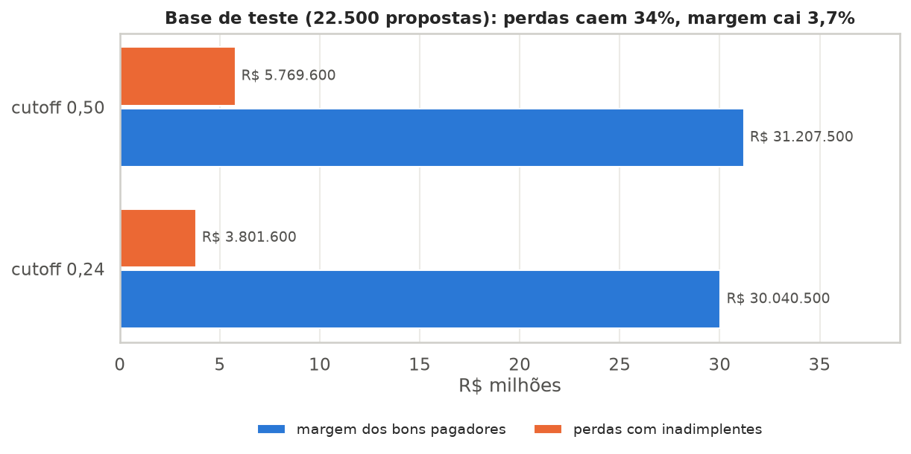
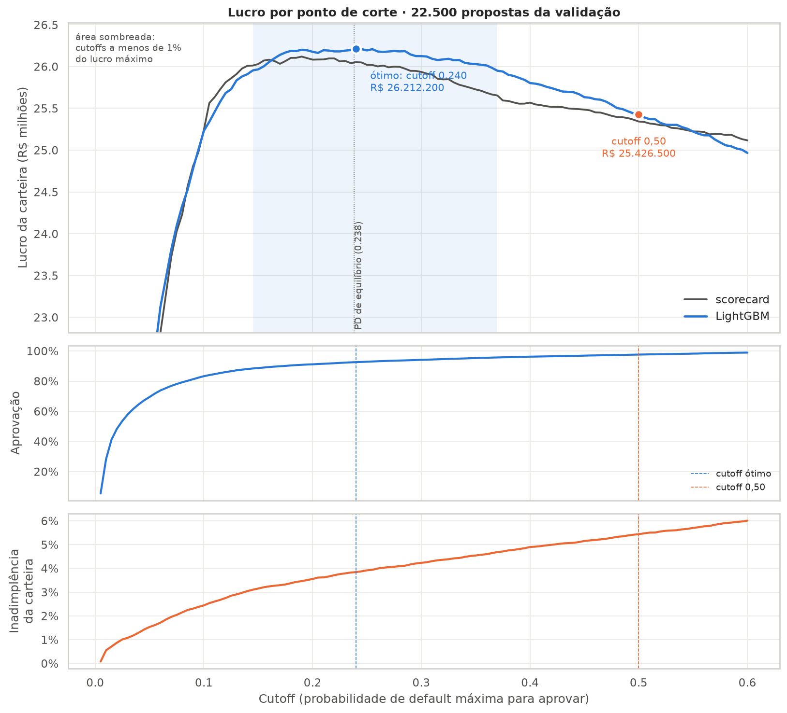
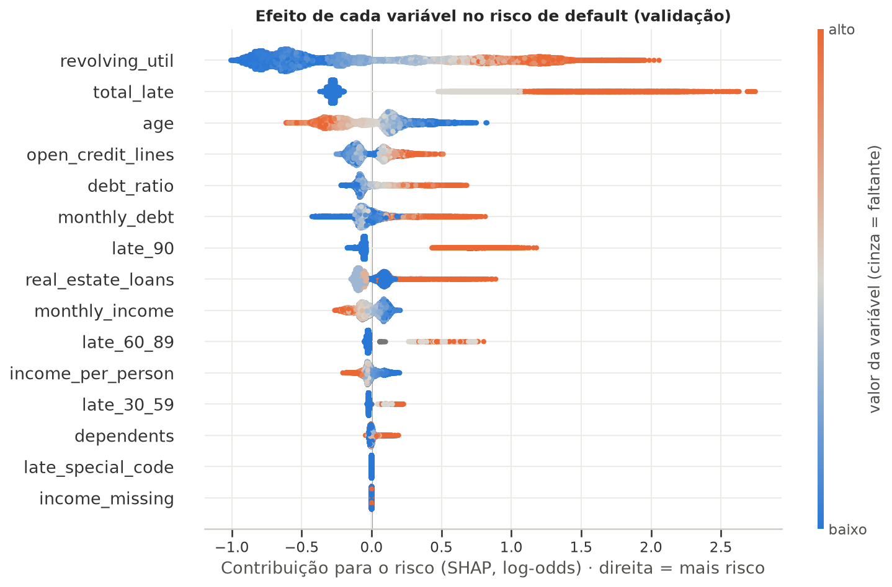

# Credit scoring com otimização de cutoff e explicabilidade

Modelo de concessão de crédito para uma cooperativa, do dado bruto à decisão: scorecard tradicional (regressão logística com WoE), LightGBM com restrições de negócio, **escolha do ponto de corte pelo lucro** e **motivos de recusa automáticos** para atender à LGPD.

> **Na base de teste, trocar o cutoff padrão de 0,50 por 0,24 reduz as perdas com inadimplência em R$ 1.968.000 (34%), abrindo mão de só 3,7% da margem.** O lucro da carteira sobe 3,1%, ou R$ 356.000 a cada 10 mil propostas.



## O problema

Uma cooperativa quer automatizar a concessão de crédito. Aprovar demais gera perdas com inadimplência, e recusar demais afasta bons pagadores. O modelo precisa ordenar bem o risco, a decisão precisa fazer sentido financeiro, e cada recusa precisa ser explicável ao cooperado (art. 20 da LGPD).

**Dados:** [Give Me Some Credit (Kaggle)](https://www.kaggle.com/c/GiveMeSomeCredit), com 150.000 tomadores e taxa de default de 6,7% (atraso de 90+ dias nos 2 anos seguintes). Divisão estratificada em treino, validação e teste (70/15/15). O teste só foi usado uma vez, no fim.

## Resultados (base de teste)

| Modelo | AUC | Gini | KS |
|---|---|---|---|
| Scorecard (logística + WoE, 7 variáveis) | 0,862 | 0,724 | 0,569 |
| **LightGBM (15 variáveis, com restrições monotônicas)** | **0,872** | **0,743** | **0,585** |

| Política (LightGBM) | Aprovação | Inadimplência da carteira | Perdas | Lucro |
|---|---|---|---|---|
| Aprovar todos | 100,0% | 6,68% | R$ 7,22 mi | R$ 24,27 mi |
| Cutoff 0,50 (padrão) | 97,8% | 5,46% | R$ 5,77 mi | R$ 25,44 mi |
| **Cutoff 0,24 (escolhido na validação)** | **92,5%** | **3,80%** | **R$ 3,80 mi** | **R$ 26,24 mi** |

Os 10% de propostas com menor score concentram 56% dos inadimplentes.

## O que eu destacaria

**1. O cutoff certo vale mais do que o algoritmo.** Com as premissas usadas (ticket de R$ 10.000, margem de 15% para bons pagadores, EAD de 80% e LGD de 60%), aprovar só compensa quando a probabilidade de default é menor que ganho ÷ (ganho + perda) = 23,8%. O cutoff ótimo encontrado empiricamente na validação (0,24) caiu em cima desse valor teórico, o que indica que as probabilidades do modelo estão bem calibradas. Na validação, o LightGBM rendeu R$ 92.700 a mais que o scorecard, e ajustar o cutoff rendeu R$ 785.700.



**2. Olhar os dados antes do modelo evitou erros sérios.** No EDA encontrei:
- valores 96 e 98 nas colunas de atraso que eram códigos de sistema, não contagens (com eles, as três colunas pareciam quase perfeitamente correlacionadas entre si);
- um `debt_ratio` que vira o valor absoluto da dívida quando a renda não é informada;
- renda faltante que não é aleatória.

Cada achado virou uma regra testada em `src/credit_scoring/features.py`.

**3. Restrições de negócio sem custo de desempenho.** O LightGBM foi obrigado a respeitar direções como "mais atraso nunca reduz o risco" e "mais idade nunca aumenta o risco". O AUC na validação cruzada ficou praticamente igual ao do modelo livre, e as explicações ficam coerentes com o que um analista de crédito esperaria.

**4. Motivos de recusa automáticos, em português.** O SHAP decompõe cada decisão, as variáveis são agrupadas em temas e os três que mais tiraram pontos viram motivos com o dado do próprio cliente. Na validação, o motivo principal do LightGBM está entre os três do scorecard em 99,9% dos casos. No teste, "Histórico de atrasos" é o motivo principal em 88% das recusas. Exemplo real de uma recusa da validação:

1. **Uso do crédito rotativo:** Saldo do crédito rotativo acima do limite contratado (105% do limite)
2. **Histórico de atrasos:** Atrasos nos últimos 2 anos: 1 atraso de 30 a 59 dias
3. **Comprometimento com dívidas:** Comprometimento de 153% da renda mensal com dívidas



**5. Um ponto levantado para compliance.** A idade aparece entre os motivos em 45% das recusas. Ela reflete um risco real nos dados, mas toca no princípio da não discriminação da LGPD. O notebook 06 mede o efeito e deixa a decisão para a área responsável, em vez de escondê-la.

## Limitações

- **As premissas financeiras são ilustrativas**, porque a base não tem valor, taxa nem recuperação. Elas ficam em `ProfitAssumptions` e a análise de sensibilidade mostra que a conclusão se mantém em vários cenários.
- **Não há dimensão de tempo na base**, então a validação é aleatória, não *out-of-time*. Em produção eu validaria em safras posteriores e monitoraria a estabilidade (PSI).
- **Só existem dados de quem recebeu crédito.** Não há como corrigir o viés de seleção (*reject inference*) com esta base.
- Os dados são de tomadores dos EUA de uma competição de 2011. Os números servem para demonstrar o método, não como referência de mercado brasileiro.

## Estrutura

```
notebooks/
  01_eda.ipynb                  análise exploratória e problemas de qualidade
  02_features.ipynb             limpeza, novas variáveis, divisão e Information Value
  03_logistic_scorecard.ipynb   coarse classing, seleção de variáveis e scorecard de pontos
  04_lightgbm.ipynb             LightGBM monotônico, comparação e calibração
  05_cutoff.ipynb               simulação financeira e escolha do ponto de corte
  06_explainability.ipynb       SHAP, motivos de recusa e checagens
  07_final_test.ipynb           avaliação única na base de teste
src/credit_scoring/             código reutilizado pelos notebooks (features, WoE, scorecard, LightGBM, cutoff, explicações)
tests/                          testes unitários (pytest)
reports/                        figuras, scorecard, motivos de recusa e metrics.json (fonte dos números deste README)
scripts/                        run_all.sh (reproduz tudo) e build_readme.py (gera este README)
```

## Como reproduzir

Requer [uv](https://docs.astral.sh/uv/) e Python 3.12.

1. Baixe `cs-training.csv` e `cs-test.csv` da [competição no Kaggle](https://www.kaggle.com/c/GiveMeSomeCredit/data) e coloque em `data/raw/`. Com a CLI do Kaggle configurada:
   ```bash
   kaggle competitions download -c GiveMeSomeCredit -p data/raw && unzip data/raw/GiveMeSomeCredit.zip -d data/raw
   ```
2. Rode tudo (instala dependências, roda os testes, executa os notebooks em ordem e regenera este README):
   ```bash
   bash scripts/run_all.sh
   ```

**Stack:** pandas, scikit-learn, LightGBM, SHAP, matplotlib/seaborn, pytest.
